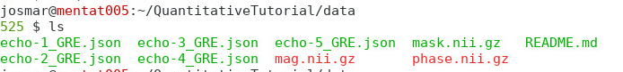

.. _fmritoolkit2023-exercise1:
.. role::  raw-html(raw)
    :format: html

Exercise 1
==========

Objectives
----------

- Understanding the data required for QSM and R2*
- Understanding why we need to correct the phase data before mapping the magnetic susceptibility

Data Required
^^^^^^^^^^^^^

- a 4D raw phase data (*phase.nii.gz* in the input directory)
- a 4D raw magnitude data (*mag.nii.gz* in the input directory)
- a 3D brain mask (*mask.nii.gz* in the input directory)
- JSON files generated by data conversion software (all .json in the input directory)

if data has not already been made available by the course organizer, it can be downloaded from the following zenodo collection 10.5281/zenodo.8340358

Estimated time
^^^^^^^^^^^^^^

About 15 min.

Understanding multi-echo GRE data
---------------------------------

If using the Donders HPC, start your an interactive session with increased memory by typing in the command in a terminal

``qsub -I -l 'walltime=20:00:00,mem=20gb'``

Go to the exercise directory which is located in ~/QuantitativeTutorial/.

You can use the following command in the terminal:

``cd ~/QuantitativeTutorial/``

.. note:: Here we assume your tutorial directory is in the home directory '~/'. If not, replace '~/' with the path containing the folder 'QuantitativeTutorial'.

To view the content of the directory use the command: ``ls``

You will see one folder in the directory.

- **data** - contains the multi-echo gradient echo images we will work on.

Go to the data directory using ``cd data`` and have a look of the content inside the folder ``ls``

You should see three NIfTI images (.nii.gz) and a few JSON files (.json) in the directory:

- The NIfTI files *mag.nii.gz* and *phase.nii.gz* contain the magnitude and the phase data acquired with a multi-echo gradient echo sequence. 

  Both images are 4D datasets, with the first 3 dimensions containing spatial information (i.e. the image of the brain) and **echo time in the 4th dimension**. 

- The NIfTI files *mask.nii.gz* contains a precomputed 3D brain mask
  
- The JSON files contain important information such as the echo times (TE) and magnetic field strength (in Tesla), and orientation of the acquisition regarding the physical coordinates of the scanner. These are important to compute the magnetic susceptibility with the correct units and ensure the physical model is correct.

Magnitude images
^^^^^^^^^^^^^^^^

#. Take a look at the magnitude images. You can do this by calling the image viewer FSLView in the terminal:

   ``fsleyes mag.nii.gz &``

   .. tip:: The '&' character will enable the viewer running in the background so you can still work with the current section in the terminal.

   .. note:: Due to the file size, it can be better to view the images with FSLView (fslview_deprecated) instead of FSLeyes (fsleyes).

#. Adjust the display window to 'Min 0' and 'Max 600000'. 

#. Click the movie button or scroll through the 4th dimention to see how the brain contrast changes with respect to the echo time.

   .. image:: images/mag_display.png
      :align: center

#. Click the movie button again to stop the movie. Press ``Ctrl+3`` to see the plot of signal evolution at different brain tissues over time. 

#. Select a few data points in the brain (e.g. Globus pallidus [108, 127, 62], white matter [89, 94, 62] and CSF [110 89, 62]), how do you describe the signal change with respect to the echo time? An exponential decay is not always quite obvious, but that is what we will assume.

#. Go back to the terminal. Compute the mean magnitude image in time:

   ``fslmaths mag.nii.gz -Tmean mean_head.nii.gz``

   This image will be used in Exercise 3.

Phase images
^^^^^^^^^^^^

To compute a magnetic susceptibility map, multi-echo gradient-echo images are usually used because it can provide phase images. 

.. toctree::
   :maxdepth: 1

   Theory_mrphase

#. Look at the phase images:

   ``fsleyes phase.nii.gz &``

   The phase images look different compared to the magnitude images and with the current display window it is hard to see any contrast in brain tissues. 

#. Adjust the display window to 'Min. -3' and 'Max. 3' and go through different slices. You should be able to identify some brain structures (e.g. at slice 61). 

   .. image:: images/phase_display.png
      :align: center

Based on Eq. :eq:`pft`, it is expected the phase increases/decreases monotonically. In other words, we should observe the phase contrasts become higher in the later echoes (i.e. bright :raw-html:`&rarr;` brighter; dark :raw-html:`&rarr;` darker). 

.. math::
   phase = frequency \times time + constant
   :label: pft

#. Click the movie button or scroll through the volumes to see the phase development over time. Can you make this observation?

#. Stop the movie and press ``Ctrl+3`` to see the phase accumulation at those problematic regions (e.g. near the prefrontal cortex [126,161,62] ). Is the phase increasing linearly? Can you identify the cause of the problem?

   .. toctree::
      :maxdepth: 1

      Exercise1_answerA
      Exercise1_answerB
      Exercise1_answerC

In order to estimate the frequency shift correctly using Eq. :eq:`pft`, this phase problem has to be addressed which is called phase unwrapping.

To unwrap the phase and to map back to the correct values, SEPIA provides several algorithms to do the job, and this is what we are going to do in the next exercise.  

You can close all the FSLeyes window(s) now.

Proceed to :ref:`fmritoolkit2023-exercise2`.
