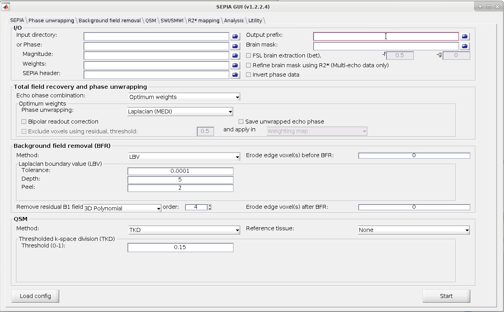

.. _fmritoolkit2023-exercise2:

Exercise 2
==========

Objectives
----------

- Gaining experience in using SEPIA;
- Creating an R2* map in SEPIA;
- Learning about the facilities provided by the SEPIA config file; 

Data Required
^^^^^^^^^^^^^

- a 4D raw phase data (*phase.nii.gz* in the input directory)
- a 4D raw magnitude data (*mag.nii.gz* in the input directory)
- a 3D raw magnitude data (*mask.nii.gz* in the input directory)
- JSON files generated by data conversion software (all .json in the input directory)

Estimated time
^^^^^^^^^^^^^^

About 15 min.

SEPIA
-----

SEPIA is a pipeline tool to process phase images and multi-echo data in Matlab. To use SEPIA, please open a Matlab application in the cluster by typing:

``matlab2021a &``,

Once Matlab is open, go to the tutorial directory and add the SEPIA home directory to the Matlab Path:

``addpath('/home/common/matlab/sepia/sepia_1.2.2.4/');``

.. note:: The SEPIA installed at the HPC already includes all the external toolboxes required. If you want don't have access to it and have to set up SEPIA from scratch in your setup, you can refer to :ref:`gettingstart-installation`.

Now, go the data directory in the Matlab command window and start sepia:

``cd ~/QuantitativeTutorial/data`` 

``sepia``

A graphical user interface (GUI) should be pop up. 

The first tab in SEPIA provides a one-step application to process QSM from the raw phase data to a magnetic susceptibility map. 

Alternatively, we could break down the processing pipeline into several seperate steps (Phase unwrapping, Background field remocal and QSM) to optimise each of those steps. You can also use SEPIA to create synthetic images derived from the mult-iecho data (SWI & SMWI), compute R2* maps (the transverse relaxation rate) or perform more advanced ROI analysis. Before any of that is done, there is one important step. 

Create a SEPIA header
^^^^^^^^^^^^^^^^^^^^^

Before using the SEPIA, create a header file that contains all essential information regarding the data acquisition (magnetic field, resolution, echo time). 

Select the **Utility** tab and then select **Get header info** in the drop-down menu. This function provides several ways to extract the header information from different files. 

With all the NifTI images and JSON files stored in the same place, we can use 'Op 2' routine: 

#. Click **Open** next to 'Op 2' and select the directory containing the json files associated with your acquisiton

   .. image :: images/get_header_open.png

#. Click **Save header** to save the file. The process is done when you see the message '*SEPIA header is saved!*' in the command window. You should see a new file is generated in the input directory. 

#. On the Matlab window, using your mouse, you can Click on **echo-1_GRE.json** and on **sepia_header.mat** files in the "Current Folder" sub-panel.
This will open the json file in a Matlab editor and the variables stored on the Workspace window and allow you to learn more about the dataset:
static field strength, orientation of the volume in respect to the static field, as well as resosolution and echo time.

   .. image :: images/Json_And_Header_Info.PNG

R2* mapping in SEPIA  
^^^^^^^^^^^^^^^^^^^^^^^^^^^^^^^^^^^^^

In the previous exercise you saw that the magnitude signal was decaying as a function of the echo time, in this exercise we will use the R2* mapping functionality to quantify the rate of that decay.

.. tip:: SEPIA supports two types of data input. If your data follows the SEPIA naming structure, you can select the directory containing all the input data as your input in the first row of **I/O** panel. Alternatively, you can specify the input files separately by following the instruction of the second row of the **I/O** panel. 

Here, for educational purposes, we will explicitely introduce the input data
In the **I/O** panel:

#. Select the **Magnitude**: *~/QuantitativeTutorial/data/mag.nii.gz*
#. Select the **SEPIA header**: *~/QuantitativeTutorial/data/sepia_header.mat*
#. Change the **Output basename** to: *~/QuantitativeTutorial/outputR2star/Sepia*

   .. image :: images/FullSepiaConfiguration_R2star.PNG

Press on the **start** button. On the command window some text will appear reflecting the progress of your pipeline as well as some of the choices you have made.  
Wait until:  '*Processing pipeline is completed!*'. 

If you navigate to the specified output directory, you will find two text files: 

#. **sepia_config.m** -  a configuration file that would allow you to rerun the same code, or create a scrip to apply it to more subjects

#. **run_sepia.logyymmddhhmmss** -  a log file with the information that had been outputed to the Command window

   .. image :: images/SEPIALogConfigfiles.PNG

You will also find 3 output niftis:

  #. **Sepia_R2starmap.nii.gz** -  your computed apparent transverse relaxation rate map
  #. **Sepia_T2starmap.nii.gz** -  your computed apparent transverse relaxation time map
  #. **Sepia_S0map.nii.gz** -  magnitude signal at time TE = 0 ms

To see some of thes images you can return to terminal and type

``cd ~/QuantitativeTutorial/data`` 

``fsleyes data/mag.nii.gz outputR2star/Sepia_S0map.nii.gz -dr 0 500000 outputR2star/Sepia_R2starmap.nii.gz -dr 0 50``

This command line will open an fsleyes window with 3 layers, the original magnitude data, the S0 and the R2* map.
You will quickly note that the R2* map contains very high values in large blood regions, as well as in deep gray matter regions.
This is because the signal in those regions decays at a faster rate. As very dark you will see the CSF whose signal decays very slowly.

   .. image :: images/FSLviewR2starmap.PNG

You can switch between the R2* map and the S0 map by, on the overlay list, clicking on the eye next to **Sepia_R2starmap**.
If you visualize again the timeline, you will see that larger R2* values are indeed obtained when the signal decays faster.

Another aspect you should notice is that the intensity of white matter in the R2* map has only fiber plausible variations while the S0 map contains intensity variations related to the RF coil used. This is one of the big advantages of quantitative imaging.

Proceed to :ref:`fmritoolkit2023-exercise3`.

Back to :ref:`fmritoolkit2023-exercise1`.
