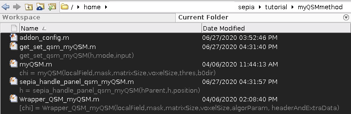
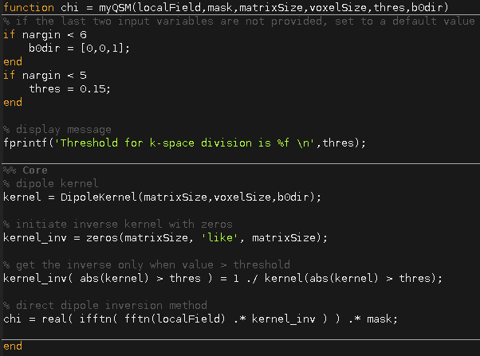
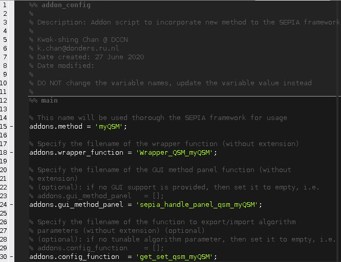

.. _integration_method_part1-index:

Integration of New Phase unwrapping/BFR/QSM Method in SEPIA: Part 1
===================================================================

Objectives
----------

- Learn how to add a new method to SEPIA framework
- Understanding structure of SEPIA processing backend

Target Audience
^^^^^^^^^^^^^^^

- who has some experience with SEPIA
- researchers who want to add their method(s) to the SEPIA framework 

Estimated Time
^^^^^^^^^^^^^^

About 30 minutes

Introduction  
------------

In this tutorial, we will practice how to integrate a new method to the SEPIA processing backend. The new method can be used in phase unwrapping/backgorund field removal/QSM dipole inversion step.

.. note:: This tutorial only demonstrates the way of adding new methods to the processing backend. To be able to have your method also shown in the SEPIA frontend GUI, please visit Part 2 of the tutorial. 

Exercise
--------

To begin with, let's go to the tutorial directory ``$SEPIA_HOME/tutorial/``. There is a folder called *myQSMmethod*. You should be able to see there are four Matlab scripts in the folder:

   
We will need ``myQSM.m``, ``Wrapper_QSM_myQSM.m`` and ``addon_config.m`` these three files in this tutorial.

We are going to explain these files in detail.

myQSM.m
^^^^^^^

Let's have a look at ``myQSM.m``

``myQSM.m`` is basically a thresholded k-space method to perform the QSM dipole inversion process. It requires 4 essential and 2 optional input variables:  

**Essential variables**

- *localField*: 3D matrix of a local (tissue) field map, unit is unimportant in this function
- *mask*: 3D matrix of a signal mask
- *matrixSize*: 1-by-3 array to indicate the matrix size of the local field map
- *voxelSize*: 1-by-3 array to indicate the spatial resolution of the local field map, in mm

**Optional variables**

- *thres*: a threshold of k-space cooridate to avoid division-by-zero problem
- *b0dir*: main magnetic field direction with respect to the local field map

The function returns one output variable which is the magnetic susceptibility map, *chi*, and has the same unit as the local field map input.

.. note:: This function is equivalent to your own QSM function to perform dipole field inversion.

Wrapper_QSM_myQSM.m
^^^^^^^^^^^^^^^^^^^

``Wrapper_QSM_myQSM.m`` is a wrapper function to connect ``myQSM.m`` to the SEPIA framework. It belongs to the comminication level of SEPIA. We will go through the function step by step to understand how it works:

.. figure:: images/figure03_WrapperQSMmyQSM.png
   :align: center

**Anatomy of Wrapper_QSM_myQSM.m**

.. code-block:: matlab

	function [chi] = Wrapper_QSM_myQSM(localField,mask,matrixSize,voxelSize,algorParam,headerAndExtraData)

First of all, you can define the function's name with your own preference but the format of input and output variables in this wrapper function are fixed and you should not make any changes on them.

.. code-block:: matlab

   % load some constants 
   sepia_universal_variables;

Some constant terms such as the gyromagnetic ratio of 1H are used in various occasions and can be called using the ``sepia_universal_variables`` function.

.. code-block:: matlab

   % get algorithm parameters, if user doesn't specify them then set some default values
   algorParam = check_and_set_algorithm_default(algorParam);
   thre_tkd   = algorParam.qsm.threshold;  % here you can define how SEPIA will store the user input in the 'algorParam' variable

In this example, we need the threshold value defined by the user to threshold the k-space coordinate in ``myQSM.m``. All the user-defined parameters of the chosen method(s) are stored in *algorParam* input in SEPIA. The variable name (e.g. *algorParam.qsm.threshold* here) is defined by the developer and used in the pipelin configuration file. ``check_and_set_algorithm_default`` is a nested function to make sure the required variable is set (either by user or using the default value) before it is used.

.. code-block:: matlab

   % get extra data such as magnitude/weights/B0 direction/TE/etc.
   headerAndExtraData = check_and_set_SEPIA_header_data(headerAndExtraData);
   b0dir = headerAndExtraData.b0dir;
   b0    = headerAndExtraData.b0;
   % magn  = headerAndExtraData.magn;  % you can access the magnitude and/or other data from the 'headerAndExtraData' variable

To create a dipole kernel with correct orientation, the algorithm needs to know the main magnetic field direction which can be obtained from the *headerAndExtraData* variable. If the multi-echo magnitude data and/or SNR-weighted map are needed, they can also be accessed in this variable as well.

.. code-block:: matlab

   % add path
   sepia_addpath;

You can add the required path(s) in the function. 

.. code-block:: matlab

   %% Display algorithm parameters
   disp('The following parameter is being used...');
   disp(['K-space threshold value  = ' num2str(thre_tkd)]);

You can also provide some feedback to user by displaying the algorithm parameters/other information in the function.

.. code-block:: matlab

   %% main
   % you can change the unit before your method if you wish
   % localField = localField/(b0*gyro); % convert from Hz to ppm

   chi = myQSM(localField,mask,matrixSize,voxelSize,thre_tkd,b0dir);
         
   % make sure the output susceptibility map is in 'ppm' which is the default
   % unit in SEPIA
   chi = chi/(b0*gyro); % convert from Hz to ppm

Once all input are ready, you can call your method to compute the susceptibility map (or local field map, depended on the objective of the method). Feel free to adapt the data for the needs of the method. The only requirement is to return the susceptibility map, *chi*, with unit of ppm.

With these two files, the method is almost ready for SEPIA. Before we can use this method in SEPIA, we need to tell SEPIA there is a new method available. To do so, we need the ``addon_config.m`` file.

addon_config.m
^^^^^^^^^^^^^^

A new method in SEPIA can only be detected when the ``addon_config.m`` file is available together with the method itself. It provides crucial information such as script names and method name for SEPIA to support its functionality.

**Anatomy of addon_config.m**

.. code-block:: matlab

   % This name will be used thorough the SEPIA framework
   addons.method = 'myQSM';

You need to specify the name of your method (i.e. 'myQSM' here). This name will be used thorough SEPIA.

.. note:: Space is allowed in the name.

.. code-block:: matlab

   % Specify the filename of the wrapper function (without extension)
   addons.wrapper_function	= 'Wrapper_QSM_myQSM';

Here we need to tell SEPIA what's the filename of myQSM wrapper function file.

These two variables will allow SEPIA to access myQSM in the processing backend. We will explain the remaining two in the next tutorial.

Now everything is ready! SEPIA only detects new methods available in the *addons* direction, i.e. ``$SEPIA_HOME/addons/``. There are three sub-directories: 'phase_unwrap', 'bfr', and 'qsm'. New method for a specific task must be added to the corresponding sub-directory. Therefore, we need to copy and past the whole folder (i.e. ``$SEPIA_HOME/tutorial/myQSMmethod/``) to the QSM addons directory ``$SEPIA_HOME/addons/qsm/``

.. figure:: images/figure05_move_directory.png
   :align: center

The method is now available in SEPIA! However, the method is only available in the processing backend. You can use the method only in command-based operation such as ``SEPIAIOWrapper.m`` and ``QSMIOWrapper.m``, e.g. :

.. code-block:: matlab

   sepia_addpath

   % Input/Output filenames
   input(1).name = '/input_dir/Sepia_local-field.nii.gz' ;
   input(2).name = '' ;
   input(3).name = '' ;
   input(4).name = '/input_dir/sepia_header.mat' ;
   output_basename = '/input_dir/output/Sepia' ;
   mask_filename = ['/input_dir/Sepia_mask-qsm.nii.gz'] ;

   % General algorithm parameters
   algorParam.general.isBET       = 0 ;
   algorParam.general.isInvert    = 0 ;
   % QSM algorithm parameters
   algorParam.qsm.reference_tissue = 'None' ;
   algorParam.qsm.method = 'myQSM' ;
   algorParam.qsm.threshold = 0.15 ;

   QSMMacroIOWrapper(input,output_basename,mask_filename,algorParam);

.. note:: For phase unwrapping method, the structure of ``addon_config.m`` is slightly different. Please check the ``addon_config.m`` file in ``$SEPIA_HOME/addons/phase_unwrap/segue/`` for more information. 

.. note:: The next part of the tutorial is about adding GUI feature to the method (i.e. method panel). For phase unwrapping method, currently no method panel is supported. Having ``addon_config.m``, ``Wrapper_???_???.m`` and your method (e.g. can be Matlab function or compiled library, etc.) would be enough for both frontend and backend of SEPIA.
