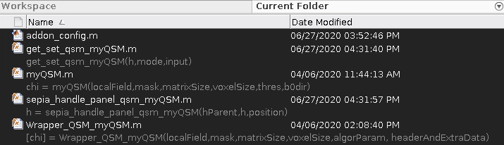
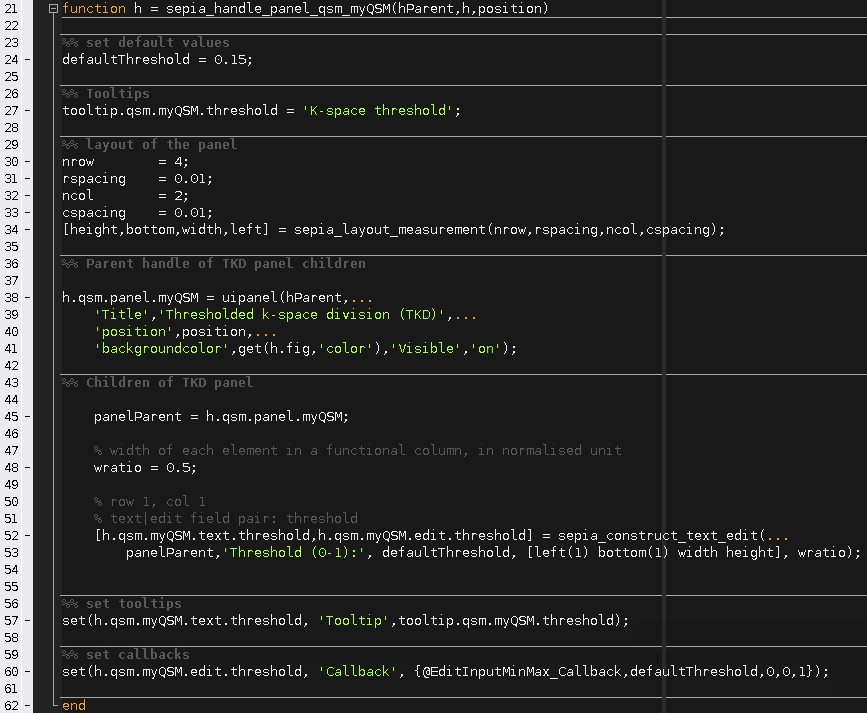
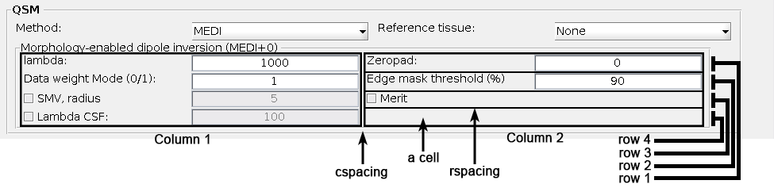

.. _integration_method_part2-index:

Integration of New Phase unwrapping/BFR/QSM Method in SEPIA: Part 2
===================================================================

Objectives
----------

- Learn how to add a new method to SEPIA GUI

Target Audience
^^^^^^^^^^^^^^^

- who has completed Part 1 of the tutorial
- researchers who want to add their method(s) to SEPIA framework 

Estimated Time
^^^^^^^^^^^^^^

About 1 hour

Introduction  
------------

In this tutorial, we will practice how to add a new method to the SEPIA GUI. you should complete the tutorial Part 1 before proceeding to this tutorial.

GUI is a major component of SEPIA. It provides the most straightfoward way to access all avaiable resources of QSM processing in SEPIA. The main goal of the GUI is to generate a pipeline configuration file (sepia_config.m) containing all the processing tasks, methods and algorithm parameters specified by the users and used to trigger the QSM processing. The configuration file can also be executed without initializing the GUI since it directly accesses the processing backend. 

The full QSM processing pipeline in SEPIA can be summarised into 4 task panels, including:

1. Data input/output panel 
2. Total field recovery and phase unwrapping panel
3. Background field removal panel
4. QSM panel

For each processing task, there are multiple methods available to perform the task. Generally, each method has it own method panel in the GUI to obtain information from the users.

.. figure:: images/figure01_method_panel.png
   :align: center
  
The method panel will be switched from one to another based on the current selected method in the task panel. 

There are two main objectives we need to accomplish in this tutorial:

1. design a method panel that can obtain information from the user, and
2. export and import the information to/from a pipeline configuration file.

Exercise
--------

If you already complete Part 1 of the tutorial, go to the addons directory ``$SEPIA_HOME/addons/qsm/myQSMmethod/``. If not, we strongly recommand go through the Part 1 of the tutorial first.

In the addons directory ``$SEPIA_HOME/addons/qsm/myQSMmethod/``, you should see there are five Matlab scripts in the folder:

   
In Part 1, we demonstrated how to connect ``myQSM.m`` to the SEPIA processing backend using ``Wrapper_QSM_myQSM.m`` as a connector and ``addon_config.m`` for SEPIA to load your method in the framework. In this tutorial, we will use the remaining two files: ``sepia_handle_panel_qsm_myQSM.m`` and ``get_set_qsm_myQSM.m``

``sepia_handle_panel_qsm_myQSM.m``
^^^^^^^^^^^^^^^^^^^^^^^^^^^^^^^^^^

In Part 1 of this tutorial, we decided that our method ``myQSM.m`` has one adjustable parameter called ``thres``, which is a threshold of the dipole kernel. In the processing backend, users can adjust the threshold value via the user algorithm input structure 'algorParam', e.g.:

.. code-block:: matlab

   algorParam.qsm.method = 'myQSM' ;
   algorParam.qsm.threshold = 0.15 ;

   QSMMacroIOWrapper(input,output_basename,mask_filename,algorParam);

We therefore need to design a panel for myQSM such that users can input their desired threshold value in the GUI.

Each method in SEPIA GUI has it own panel to obtain information from users. This information can be a value (e.g. tolerance), a decision (e.g. true/false), a selection (given choices) and many others. We will go through the script to understand how a panel can be designed in SEPIA GUI.

   
**Anatomy of sepia_handle_panel_qsm_myQSM.m**

.. code-block:: matlab

	function h = sepia_handle_panel_qsm_myQSM(hParent,h,position)

For every new panel you can decide a new name of the function. However, the input and output variables are fixed and should not be changed.

.. code-block:: matlab

   %% set default values
   defaultThreshold = 0.15;

We first decide the default input value that will be showed in the GUI.

.. code-block:: matlab

   %% Tooltips
   tooltip.qsm.myQSM.threshold	= 'K-space threshold';

You can also add tooltips to further explain the information the method required.

.. code-block:: matlab

   %% layout of the panel
   nrow        = 4;
   rspacing    = 0.01;
   ncol        = 2;
   cspacing    = 0.01;
   [height,bottom,width,left] = sepia_layout_measurement(nrow,rspacing,ncol,cspacing);

In principle develops can design the layout of the method panel with their own style. In SEPIA, the ``sepia_layout_measurement`` function can help standardise the panel layout by creating a evenly distributed grid. It requires the following input:

- *nrow*: number of rows in the grid
- *rspacing*: spacing between consecutive rows, in normalised unit
- *ncol*: number of columns in the grid
- *cspacing*: spacing between consecutive columns, in normalised unit

It returns four variables that specify the position of each cell in the grid:

- *height*: height of the cell, in normalised unit
- *bottom*: 1-by-*nrow* array indicating the bottom position of the cell, starting from the top of the panel
- *width*: width of the cell, in normalised unit
- *left*: 1-by-*ncol* array indicating the left position of the cell, starting from the left

.. code-block:: matlab

   h.qsm.panel.myQSM = uipanel(hParent,...
      'Title','My QSM dipole inversion',...
      'position',position,...
      'backgroundcolor',get(h.fig,'color'),'Visible','on');

Firstly, we create a panel in SEPIA. This panel belongs to the QSM task panel which is specified in the *hParent* input. The only thing you can change is the '*Title*' value here. 

.. code-block:: matlab

   panelParent = h.qsm.panel.myQSM;

    % width of the first element in a cell, in normalised unit
    wratio = 0.5;
    
    % row 1, col 1
    % text|edit field pair: threshold
    [h.qsm.myQSM.text.threshold,h.qsm.myQSM.edit.threshold] = sepia_construct_text_edit(...
        panelParent,'Threshold (0-1):', defaultThreshold, [left(1) bottom(1) width height], );

Secondly, we can start adding operational functions to the method panel. There are many operations you can add to the method panel in order to obtain input from users. SEPIA provides three functions to simplify the work of adding operations to the panel, including:

1. ``sepia_construct_text_edit``: create a 'text|edit' pair to obatin (numerical) input from users;
2. ``sepia_construct_text_popup``: create a 'text|popup' pair to obatin predefined input from users by selection;
3. ``sepia_construct_checkbox_edit``: create a 'checkbox|edit' pair to obatin a logical decision (true or false) from users plus an optional numerical input.

.. figure:: images/figure05_operation.png
   :align: center

These three functions cover most of the operations in SEPIA. For detail description of how the functions work please check the header of the functions. In this tutorial, we only use the ``sepia_construct_text_edit`` function to obatin the k-space threshold value from the user.

.. code-block:: matlab

   function [h_text,h_edit] = sepia_construct_text_edit(parent,fieldString,defaultValue,pos,wratio)

``sepia_construct_text_edit`` requires 5 input variable:

- *parent*: parent handle of the operation, which is the handle of the panel (e.g. *h.qsm.panel.myQSM*)
- *fieldString*: the text displayed in the 'text' field of the operation (e.g. *'Threshold (0-1):'*)
- *defaultValue*: the value displayed in the 'edit' field of the operation (e.g. *defaultThreshold*)
- *pos*: the position of the entire operation ('text'+'edit' fields), [left bottom width height] (e.g. [*left(1) bottom(1) width height*])
- *wratio*: the normalised width taken by the 'text' field.

The function returns two output variables:

- *h_text*: handle of the 'text' field, (e.g. *h.qsm.myQSM.text.threshold* in this tutorial)
- *h_edit*: handle of the 'edit' field, (e.g. *h.qsm.myQSM.edit.threshold*)

.. figure:: images/figure06_construct_example.png
   :align: center

These three SEPIA functions are resbonsible for only creating the GUI components. The function of these operations are still missing. 

.. code-block:: matlab

   %% set tooltips
   set(h.qsm.myQSM.text.threshold, 'Tooltip',tooltip.qsm.myQSM.threshold);

Here we set the tooltips that was defined in the beginning of the file to the 'text' field of the panel.

.. code-block:: matlab

   %% set callbacks
   set(h.qsm.myQSM.edit.threshold, 'Callback', {@EditInputMinMax_Callback,defaultThreshold,0,0,1});

The callback function allows developer to control the behaviour of the user input. Here we utilise a function called ``EditInputMinMax_Callback`` in SEPIA to limit the range of the input value from the users. Let's have a look to this function

.. code-block:: matlab

   EditInputMinMax_Callback(source,eventdata,defaultValue,isIntegerInput,lb,ub)

Ingoring the input variables *source* and *eventdata*, this function takes three extra input from the developer:

- *defaultValue*: whenever an invalid value is entered, returns to this value (e.g. returns to *defaultThreshold* in this tutorial)
- *isIntegerInput*: whether the input is an integer or not (*true* or *1*: input needed to be integer; *false* or *0*: input can be floating number) (e.g. the input can be floating number in this tutorial)
- *lb*: lower bound of the input value (e.g. the minimum number is *0* in this example)
- *ub*: upper bound of the input value (e.g. the maximum number is *1* in this example)

Now, the method panel is ready for the GUI. Our next job is to make sure the user input can be correctly exported to the pipeline configuration file and afterward imported from the pipeline configuration file to the GUI which will be done the next section.

``get_set_qsm_myQSM.m``
^^^^^^^^^^^^^^^^^^^^^^^

Once the method panel is setup, our final task is to translate this information from the GUI to the pipeline configuration file (sepia_config.m) in a way the processing backend can understand. This job is done by the ``get_set_qsm_myQSM.m`` file.

In Part 1 of this tutorial, we defined a variable named ``algorParam.qsm.threshold`` in the wrapping function ``Wrapper_QSM_myQSM.m`` to allow user to adjust the threshold on the dipole kernel, i.e.

.. code-block:: matlab

   % get algorithm parameters, if user doesn't specify them then set some default values
   algorParam = check_and_set_algorithm_default(algorParam);
   thre_tkd   = algorParam.qsm.threshold;  % here you can define how SEPIA will store the user input in the 'algorParam' variable

The usage of the variable name ``algorParam.qsm.threshold`` is consistent thorough all levels of the SEPIA framework. This means the name and the structure of ``algorParam.qsm.threshold`` are the same in the sepia_config.m file as in the ``Wrapper_QSM_myQSM.m`` file which is the connector between SEPIA and the main script of processing. 

In a nutshell, ``get_set_qsm_myQSM.m`` obtains the user input value from the GUI and converts it in a correct format in the pipeline configuration file. It is also responsible to read the value from the pipeline configuration file and update the number shown in the GUI when users load the pipeline configuration file back to the GUI.

We are going to explain how to archieve all these in ``get_set_qsm_myQSM.m``. 

.. figure:: images/figure07_getset_script.png
   :align: center
   
**Anatomy of get_set_qsm_myQSM.m**

.. code-block:: matlab

	function get_set_qsm_myQSM(h,mode,input)

``get_set_qsm_myQSM.m`` has three predefined input variables. No modfication is allowed here.

.. code-block:: matlab

	str_pattern = {'.qsm.threshold'};

``str_pattern`` stores all the sub-structures you defined in ``Wrapper_QSM_myQSM.m`, e.g. the ``.qsm.threshold`` part of ``algorParam.qsm.threshold``. The string pattern specified here will be printed on the pipeline configuration file and read into GUI when the configuration file is loaded. For methods with multiple input, separate the sub-structure string patterns of the corresponding input using ','. 

.. code-block:: matlab

	action_handle = {h.qsm.myQSM.edit.threshold};

``action_handle`` contains all the GUI handles of where the information is exported/imported. In this example, the threshold is specified in ``h.qsm.myQSM.edit.threshold`` in the GUI function (see above section). 

.. note:: The handle variable stored in ``action_handle`` must have the same position as in ``str_pattern``.

.. code-block:: matlab

	switch lower(mode)

The variable ``mode`` here corresponds to 

1. 'set': exporting the GUI input to a pipeline configuration file; 
2. 'get': importing values in a pipeline configuration file to the GUI.

.. code-block:: matlab

   case 'set'
      fid = input;
      
      fprintf(fid,'algorParam%s = %s ;\n'	,str_pattern{1},get(action_handle{1},	'String'));

In 'set' scenario, ``get_set_qsm_myQSM.m`` tries to export information from the GUI to a pipeline configuration file (sepipa_config.m). The first line ``fid = input;`` is just to obtain the sepia_config.m file ID in order to write something to the file in the second line. 

There are two formatted text data (%s) we need to write, the first %s corresponds to the algorithm parameter sub-structure, in this case adding text specified in ``str_pattern`` which is '.qsm.threshold' after the text 'algorParam'. The second %s corresponds to the value in the ``action_handle`` (i.e. ``h.qsm.myQSM.edit.threshold``) which is the value specified in the GUI. The input obtained from an 'edit' field in the GUI is in text instead of a number. Therefore %s is used.

.. code-block:: matlab

   case 'get'

      config_txt = input;
      
      % first edit field
      val             = get_num_as_string(config_txt, str_pattern{1}, '=', ';');
      set_non_nan_value(action_handle{1},'String',val)

In 'get' scenario, ``get_set_qsm_myQSM.m`` tries to import information from a pipeline configuration file back into the GUI. Noted that the input variable ``input`` contains file ID in the 'set' scenario while here it contains all the text in the input pipeline configuration file. 

The first task here is to obatin the required value from the pipeline configuration file. This is done via the ``get_num_as_string`` function, which captures information stated as a number in the text to the Matlab text format. The ``get_num_as_string`` function has four input variables:

.. code-block:: matlab

   str = get_num_as_string(A, str_pattern, start_indicator, end_indicator)

The first input, ``A``, in a variable containing all text of the pipeline configuration file.
The second input, ``str_pattern`` is a variable that contains a specific string of text, that is '.qsm.threshold' in this example.
The third and fourth input, ``start_indicator`` and ``end_indicator`` indicate that the position of the required information after ``str_pattern``. In this example, the threshold is exported as ``algorParam.qsm.threshold = 0.1 ;`` specified in the 'set' scenario. Therefore, the threshold value can be captured between the special characters '=' and ';', corresponding to the ``start_indicator`` and ``end_indicator`` input.

Once we obtain the threshold value as text format stored in ``val``, the second task is to update the corresponding value shown in the GUI, which is done in the last line here.

With these two files ready, our new QSM dipole inversion method can now work properly with the SEPIA GUI. Start the SEPIA GUI and try it out!

Here we demonstrated the simpliest way to incorporate a new method in the SEPIA framework. There are so much more options available to obtain user input for your method, as shown in the MEDI method panel and the FANSI method panel. You can also check out the ``sepia_handle_panel_qsm_???.m``, ``get_set_qsm_???.m`` and ``Wrapper_QSM_???.m`` files to understand how the GUI function of other existing methods is designed. 

