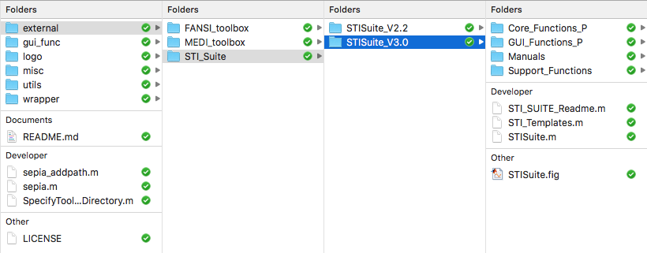

.. _gettingstart-installation:

Installation
============

Prerequisite  
------------

To unleash the fully functionality of **SEPIA**, four external libraries, which are freely available for academic purposes, are required, namely MEDI toolbox, STI suite, FANSI toolbox and SEGUE. You can download these toolboxes/libraries using the following links:

- `MEDI toolbox <http://pre.weill.cornell.edu/mri/pages/qsm.html>`_ (version 15 January 2020)
- `STI Suite <https://people.eecs.berkeley.edu/%7Echunlei.liu/software.html>`_ (version 3.0)
- `FANSI toolbox <https://gitlab.com/cmilovic/FANSI-toolbox>`_ (commit dc68c306)

If you encounter any difficulty to download these toolboxes please let us know by opening a new issue in the `GitHub page <https://github.com/kschan0214/sepia/issues>`_.  

Installation of  SEPIA
----------------------

Once you have all the toolboxes in place, then you have to specify the directory of each toolbox in `SpecifyToolboxesDirectory.m <https://github.com/kschan0214/sepia/blob/master/SpecifyToolboxesDirectory.m>`_:

.. code-block:: matlab

   MEDI_dir = '/path/to/MEDI/toolbox/';  
   STISuite_dir = '/path/to/STISuite/toolbox/';   
   FANSI_dir = '/path/to/FANSI/toolbox/'; 
   SEGUE_dir = '/path/to/SEGUE/library/;'
 

For example, I have all my external toolboxes stored under the SEPIA home directory. Additionally, for each toolbox, I have different copies representing different versions when they were published  

and here is an example of how is my SpecifyToolboxesDirectory.m defined:

.. code-block:: matlab

    % 1. sepcify the toolbox version you want to run
    MEDI_version        = 'MEDI_toolbox_20180625';
    FANSI_version       = 'FANSI-toolbox-d33759b970790cc8754adc9d0398cc3d07546074/';
    STISuite_version    = 'STISuite_V3.0';

    % 2. get the Sepia HOME directory from this script
    fullName        = mfilename('fullpath');
    SEPIA_HOME      = fileparts(fullName);

    % 3. specify the top level of external dependency directory
    external_dir    = [SEPIA_HOME filesep 'external' filesep];

    % 4. specify the HOME directory of each toolbox
    MEDI_HOME       = [external_dir 'MEDI_toolbox' filesep];
    FANSI_HOME      = [external_dir 'FANSI_toolbox' filesep];
    STISuite_HOME   = [external_dir 'STI_Suite' filesep];

    % 5. sepcify the final destination of each toolbox you want to run in Sepia
    MEDI_dir        = [MEDI_HOME MEDI_version filesep];
    FANSI_dir       = [FANSI_HOME FANSI_version filesep];
    STISuite_dir    = [STISuite_HOME STISuite_version filesep];

**IMPORTANT: Please do not modify the original structure of these toolboxes, SEPIA searches the path of the related functions based on the original folder structure.**   

Finally, you have to add the directory containing `sepia.m <https://github.com/kschan0214/sepia/blob/master/sepia.m>`_, i.e. the SEPIA HOME directory, to your MATLAB PATH

This can be done by:
'Set Path' -> 'Add Folder' -> /your/sepia/directory/ -> 'Save'  

(**Caution**: To ensure only the selected algorithm is used for the QSM processing, please do not manually add the paths to the external toolboxes you want to run in SEPIA to the Matlab PATH, the `sepia_addpath` function will do the job for you:).)  

or

with MATLAB's command: ``addpath('/your/sepia/directory')``  

Now you can start the GUI by entering ``sepia`` in the MATLAB's command window.

Compatibility
-------------

SEPIA is developed mainly in MATLAB R2016b in Linux. In general, all methods should compatible with earlier MATLAB versions. Most of the methods should also compatible with MATLAB R2017a or later, and other OS, except the following functions/algorithms

- DICOM reader
- Laplacian Boundary Value (LBV) for background field removal
- Graphcut for phase unwrapping