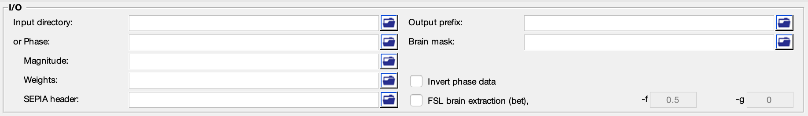

SEPIA (One-stop QSM processing)
===============================

What is SEPIA?
--------------

SEPIA is a quantitative susceptibility mapping (QSM) pipeline analysis tool for (but not limited to) neuroimaging application. It provides all the essential functions to compute a susceptibility map from a 3D multi-echo GRE phase data, including phase unwrapping, background field contribution removal and dipole inversion. Incorporating with different toolboxes in SEPIA gives users the advantages of having a variety of options to build a pipeline that works the best for their data. When you use the SEPIA graphical user interface to process the data, a configuration (config) file will be generated that contains all the settings and commands that you've specified in the pipeline. This config file will be particularly useful for batch processing. 

Structure of the application
----------------------------

This standalone consists of 4 panels:

- Input/Output(I/O) panel,  
- Total field recovery and phase unwrapping panel,  
- Background field removal panel, and  
- QSM panel.

The description of each panel is given below:

I/O panel
^^^^^^^^^

The I/O panel is responsible for data input/output and data processing that is not specific to QSM.

- Data input  

  There are two pathways to specify input in this application:

  .. image:: images/IO_panel_pathway.png

  1. Specify a directory that contains all essential data. 

    The essential data are:

    +--------------------+-----------------------------------------------------------------------------------------------------------------------+
    | Data               | Description                                                                                                           |
    +====================+=======================================================================================================================+
    | Phase              | 4D phase of GRE ([x,y,slice,time]), must contain 'ph' in the filename, e.g. *phase.nii.gz* or *ph.nii.gz*,            |
    +--------------------+-----------------------------------------------------------------------------------------------------------------------+
    | Magnitude          | 4D magnitude of GRE ([x,y,slice,time]), must contain 'mag' in the filename, e.g. *magn.nii.gz* or *mag.nii.gz*;       |
    +--------------------+-----------------------------------------------------------------------------------------------------------------------+ 
    | Header             | see :ref:`sepia-header` for more information, must contain 'header' in the filename, e.g. *header.mat*                |
    +--------------------+-----------------------------------------------------------------------------------------------------------------------+ 
    | Mask               | (optional) 3D signal mask, if provided, must contain string 'mask' in the filename, e.g. *mask.nii.gz*                |
    +--------------------+-----------------------------------------------------------------------------------------------------------------------+ 

    .. warning::
      Please make sure the filenames follow the above rules and no other files in the directory sharing the same string labels (i.e. 'ph', 'mag', 'header' and 'mask').

  2. Specify the required data separately using the GUI buttons. 

    .. note::
      The 'Weights' input is an optional input. You can specify a 3D data which will be used as prior information in regularised optimisation in QSM dipole inversion. If the 'Weights' input is empty, the weighting map will be automatically computed in subsequent QSM processing.

- Output prefix

  By default, the output files generated by SEPIA will be stored in a directory named '*output*' under the directory of the input files (i.e. '_/your/input/directory/output/_'). The prefix of the output filename is '*Sepia*'. You can change the default output directory and prefix according to your preference. If the output directory does not exist, the application will create the directory.  

  .. note::
    Make sure the 'Output prefix' field contains a full path of the output directory and a filename prefix.
  
- Brain mask  

  You can optionally specify a signal (brain) mask NIfTI file. If this input is empty and no mask is found in the input directory, SEPIA will automatically run the FSL's brain extraction tool (bet) provided with MEDI toolbox to compute the brain mask.

- Invert phase data   

  Checking this option will invert the contrast of the SEPIA output frequency and QSM maps. Mathematically it inverse the signal phase by computing the signal conjugate. It is useful if you want to have specific colour scheme for QSM (e.g. dark colour for paramagnetic susceptibility).

- FSL brain extraction (bet)

  Brain mask can be computed using the Matlab implementation of FSL's BET provided with MEDI toolbox, with options including fractional intensity threshold (-f) and vertical in fractional intensity threshold (-g). More information regarding the options can be found in `BET/UserGuide <https://fsl.fmrib.ox.ac.uk/fsl/fslwiki/BET/UserGuide>`_.

Total field recovery and phase unwrapping panel
^^^^^^^^^^^^^^^^^^^^^^^^^^^^^^^^^^^^^^^^^^^^^^^

.. image:: images/tf_panel.png

- Echo phase combination  

  As the first step to process the multi-echo data, we need to recover the total frequency shift of the tissue across times. SEPIA provides two different ways to do this:

  1. `Optimum weights <https://doi.org/10.1002/nbm.3601>`_  

    This is a weighted combination of the phase difference between successive echoes, in which the weights are inversely proportional to the variance of the noise of the fieldmap estimated from the magnitude echo images.

  2. **MEDI nonlinear fit**  

    This is a method in the MEDI toolbox  

- Phase unwrapping  

  There are 5 phase unwrapping method supported in SEPIA

  1. `Laplacian <https://doi.org/10.1016/j.neuroimage.2010.11.088>`_ 

    Laplacian unwrapping implementation in MEDI toolbox

  2. `Laplacian STI suite <https://doi.org/10.1016/j.neuroimage.2010.11.088>`_  

    Laplacian unwrapping implementation in STI Suite v3.0  

  3. `3D best path <https://doi.org/10.1364/AO.46.006623>`_   

    Robust region growing method yet only works in the DCCN cluster (recommended if you use this toolbox in the DCCN cluster)  

  4. **Region growing**  
  
    Region growing method in the MEDI toolbox 
  
  5. `Graphcut <https://doi.org/10.1109/TMI.2014.2361764>`_  

    Graph-cut algorithm in the MEDI toolbox, sometimes uses with water-fat imaging.
		
- Bipolar readout eddy current correction:   

  enable to correct the phase inconsistency between odd and even echoes, and a gradient-like field contribution by eddy current effect due to bipolar readout.
  If this option is enabled, the eddy current corrected data will be stored in the output directory with the following name:

  - *phase_eddy-correct.nii.gz* (eddy current corrected phase data) 
  
- Exclude unreliable voxels, Threshold:  

  enable to exclude low SNR voxels that can create strong artefacts in susceptibility map (you may check with '*relative-residual.nii.gz*' to adjust the threshold). Voxels that have relative fitting residual greater than the threshold will be weighted with zero in subsequent processes. Only available for region growing and 3D best path unwrapping methods. 

- Output  

  The output of this step are given below:

  - *total-field.nii.gz* 	(unwrapped total (background+local) field, in Hz)  
  - *fieldmap-sd.nii.gz* 	(normalised field map standard deviation)  
  - *mask.nii.gz* (FSL's bet brain mask, optional)
  - *mask-reliable.nii.gz* (thresholded brain mask, optional)
  - *relative-residual.nii.gz* (relative residual of fitting a mono-exponential decay function with a single frequnecy shift, depends on unwrapping method)

Background field removal panel
^^^^^^^^^^^^^^^^^^^^^^^^^^^^^^

- Method

  1. `LBV <https://doi.org/10.1002/nbm.3064>`_  

     Laplacian boundary value approach to removal background field  

  2. `PDF <https://doi.org/10.1002/nbm.1670>`_  

     Projection onto dipole field  

  3. `RESHARP <https://doi.org/10.1002/mrm.24765>`_  

     regularisation enabled SHARP  

  4. `SHARP <https://doi.org/10.1016/j.neuroimage.2010.10.070>`_  

     Sophisticated harmonic artefact reduction for phase data  

  5. `VSHARP STI suite <https://doi.org/10.1016/j.neuroimage.2010.11.088>`_   

     STI suite v3.0 variable-kernel SHARP 

  6. `VSHARP <https://doi.org/10.1016/j.neuroimage.2010.11.088>`_  

  7. `iHARPERELLA <https://doi.org/10.1002/nbm.3056>`_   

     (not optimised with SEPIA yet)  

- Refine local field by 4th order 3D polynomial fit  

  Enable to remove residual B1(+ & -) contribution in the local field

- Output  

  The output of this step are given below:

  - *local-field.nii.gz* (local (or tissue) field, in Hz)  
  - *mask-qsm.nii.gz* (brain mask where local field is reliable, might be eroded and depended on the background field removal algorithms and '**exclude unreliable voxels**' threshold value)  

QSM panel
^^^^^^^^^

- Method:

  1. `TKD <https://doi.org/10.1002/mrm.22334>`_  

     Thresholded k-space division

  2. `Closed-form solution <https://doi.org/10.1002/jmri.24365>`_  

     closed-form solution with L2-norm regularisation

  3. `STI suite iLSQR <https://doi.org/10.1016/j.neuroimage.2010.11.088>`_  

     STI suite v3.0 implementation of iterative LSQR approach

  4. `iLSQR <https://doi.org/10.1016/j.neuroimage.2010.11.088>`_

  5. `FANSI <https://doi.org/10.1002/mrm.27073>`_  

     Fast algorithm for nonlinear susceptibility inversion

  6. `Star <https://doi.org/10.1002/nbm.3383>`_ 

     STI suite v3.0 Star-QSM (recommended)

  7. `MEDI <https://doi.org/10.1002/mrm.26946>`_  

     Morphology enabled dipole inversion (MEDI+0)   
  
- Output     

  The output of this step is given below:

  - *QSM.nii.gz* (quantitative susceptibility map, in ppm) 