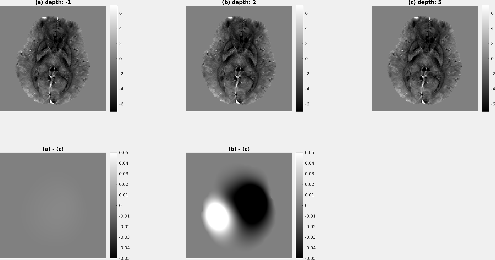
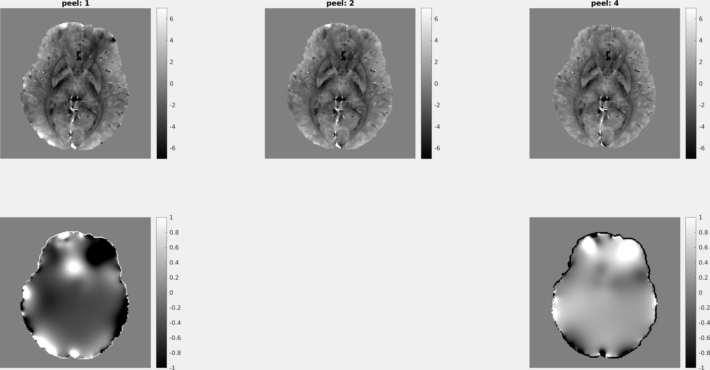

.. _method-bfv-lbv:
.. _bfv-lbv:
.. role::  raw-html(raw)
    :format: html

Laplacian Boundary Value approach (LBV)
=======================================

.. image:: ../images/bfr/LBV.png

Reference
---------

`Zhou, D., Liu, T., Spincemaille, P., Wang, Y., 2014. Background field removal by solving the Laplacian boundary value problem. NMR in biomedicine 27, 312–319. <https://doi.org/10.1002/nbm.3064>`_ 

Algorithm parameters overview
-----------------------------

+---------------------------+--------------------------------------------------------------------------------------------------------------+
| algorParam.bfr.           | Description                                                                                                  |
+===========================+==============================================================================================================+
| tol                       | Iteration stopping criteria on the coarest grid                                                              |
+---------------------------+--------------------------------------------------------------------------------------------------------------+
| depth                     | No. of length scales                                                                                         |
+---------------------------+--------------------------------------------------------------------------------------------------------------+ 
| peel                      | No. of boundary layers to be peeled off                                                                      |
+---------------------------+--------------------------------------------------------------------------------------------------------------+ 

Usage
-----

algorParam.bfr.tol
^^^^^^^^^^^^^^^^^^

Iteration stopping criteria on the coarest grid 

**Default Value: 0.0001**

Examples:

``algorParam.bfr.tol = 1;``

``algorParam.bfr.tol = 0.01;``

``algorParam.bfr.tol = 0.0001;``

.. image:: images/lbv_tol_result.png

algorParam.bfr.depth
^^^^^^^^^^^^^^^^^^^^

No. of length scales 

**Default Value: 5**

Examples:

``algorParam.bfr.depth = -1;``

``algorParam.bfr.depth = 2;``

``algorParam.bfr.depth = 5;``

algorParam.bfr.peel
^^^^^^^^^^^^^^^^^^^^

No. of boundary layers to be peeled off

**Default Value: 2**

Examples:

``algorParam.bfr.peel = 1;``

``algorParam.bfr.peel = 2;``

``algorParam.bfr.peel = 4;``

