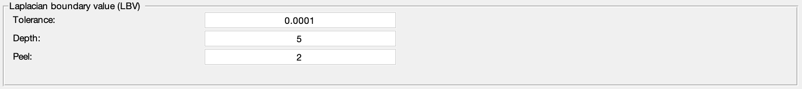

.. _method-bfv-lbv:
.. _bfv-lbv:
.. role::  raw-html(raw)
    :format: html

Laplacian Boundary Value approach (LBV)
=======================================

Reference:
`Zhou, D., Liu, T., Spincemaille, P., Wang, Y., 2014. Background field removal by solving the Laplacian boundary value problem. NMR in biomedicine 27, 312–319. <https://doi.org/10.1002/nbm.3064>`_ 

