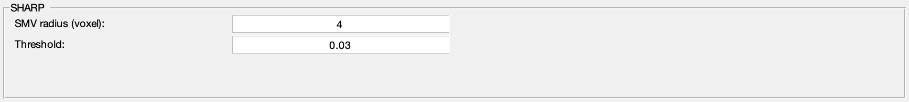

.. _method-bfv-sharp:
.. _bfv-sharp:
.. role::  raw-html(raw)
    :format: html

Sophisticated Harmonic Artefact Reduction for Phase data (SHARP)
================================================================

Reference:
`Schweser, F., Deistung, A., Lehr, B.W., Reichenbach, J.R., 2011. Quantitative imaging of intrinsic magnetic tissue properties using MRI signal phase: an approach to in vivo brain iron metabolism? Neuroimage 54, 2789–2807. <https://doi.org/10.1016/j.neuroimage.2010.10.070>`_ 

