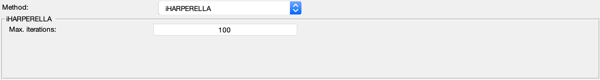

.. _method-bfv-iHARPERELLA:
.. _bfv-iHARPERELLA:
.. role::  raw-html(raw)
    :format: html

Improved HARmonic (background) PhasE REmovaL using the LAplacian operator (iHARPERELLA)
=======================================================================================

Reference:
`Li, W., Avram, A.V., Wu, B., Xiao, X., Liu, C., 2014. Integrated Laplacian-based phase unwrapping and background phase removal for quantitative susceptibility mapping. NMR in biomedicine 27, 219–227. <https://doi.org/10.1002/nbm.3056>`_ 

