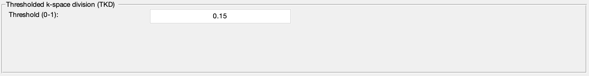

.. _method-qsm-tkd:
.. _qsm-tkd:
.. role::  raw-html(raw)
    :format: html

Thresholded k-space Division (TKD)
==================================

Reference:
`Wharton, S., Schäfer, A., Bowtell, R., 2010. Susceptibility mapping in the human brain using threshold-based k-space division. Magnetic resonance in medicine 63, 1292–1304. <https://doi.org/10.1002/mrm.22334>`_ 

