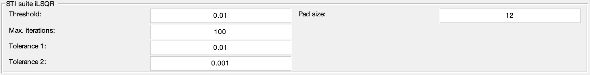

.. _method-qsm-ilsqrstisuite:
.. _qsm-ilsqrstisuite:
.. role::  raw-html(raw)
    :format: html

Iterative LSQR (iLSQR STI Suite)
================================

Reference:
`Li, W., Wu, B., Liu, C., 2011. Quantitative susceptibility mapping of human brain reflects spatial variation in tissue composition. Neuroimage 55, 1645–1656. <https://doi.org/10.1016/j.neuroimage.2010.11.088>`_ 

