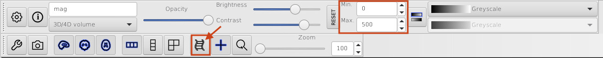

.. _fmritoolkit2019-exercise1:
.. role::  raw-html(raw)
    :format: html

Exercise 1
==========

Objectives
----------

- Understanding the data required for QSM
- Understanding why we need to correct the phase data before mapping the magnetic susceotibility

Data Required
^^^^^^^^^^^^^

- a 4D raw phase data (*phase.nii.gz* in the input directory)
- a 4D raw magnitude data (*mag.nii.gz* in the input directory)
- JSON files generated by data conversion software (all .json in the input directory)

Estimated time
^^^^^^^^^^^^^^

About 10 min.

Understanding multi-echo GRE data
---------------------------------

To compute a magnetic susceptibility map, multi-echo gradient-echo images are usually used because it can provide phase images. 

[See theory]

Go to the exercise directory which is located in ~/qsm_tutorial/.

You can use the following command in the terminal:

``cd ~/qsm_tutorial/``

To view the content of the directory use the command: ``ls``

.. image:: images/exercise_directory.png
   :align: center

You will see there are two folders in the directory.

- **sepia** - contains the software we will use through out this tutorial;
- **data** - contains the multi-echo gradient echo images we will work on.

Go to the data directory using ``cd data`` and have a look of the content inside the folder ``ls``

.. image:: images/ls.png
   :align: center

You will see two NIfTI images (.nii.gz) and a few JSON files (.json) in the directory:

- The NIfTI files mag.nii.gz and phase.nii.gz contain the magnitude and the phase data acquire with a multi-echo gradient echo sequence. 

  Both are 4D datasets, with the first 3 dimensions containing spatial information (i.e. the image of the brain) and echo time in the 4th dimension. 

- The JSON files contain important information such as the echo times (TE) and magnetic field strength (in Tesla), and  orientation of the acquisition in respect to the physical cordinates of the scanner. These are important to compute the magnetic susceptibility with the correct units and ensure the physical model is correct.

Take a look at the magnitude images. You can do this by calling the image viewer FSLeyes in the terminal:

``fsleyes mag.nii.gz``

Once you have the magnitude images opened in the viewer, adjust the display window to 'Min. 0' and 'Max. 300'. Then click the movie button to see how the brain contrast changes over time.

You can also press ``Ctrl+3`` to see the plot of signal evolution at different brain tissues. Select a few data points in the brain (e.g. [98 169 87], [143 106 92], and [159 190 77]), how do you describe the signal curve? 

.. toctree::
   :maxdepth: 1

   Exercise1_progress1

Take a look of the phase images:

``fsleyes phase.nii.gz``

The phase images look different compared to the magnitude images and with the current display window it is hard to see any contrast of brain tissues. 

Adjust the display window to 'Min. -3.14' and 'Max. -1', you should be able to identify some brain structures. 

.. image:: images/phase_display.png
   :align: center

Look at how the phase develops over time 
^^^^^^^^^^^^^^^^^^^^^^^^^^^^^^^^^^^^^^^^^

Change the window back to [-3.14,3.14] and click the movie button again to see the phase development over time. Based on Eq. :eq:`pft`, it is expected the phase increases/decreases monotonically. In other words, we should observe the phase contrasts become higher in the later echoes (bright :raw-html:`&rarr;` berigher; dark :raw-html:`&rarr;` darker). Can you make this observation?

.. math::
   phase = frequency \times time
   :label: pft

.. toctree::
   :maxdepth: 1

   Exercise1_progress2

It seems that in some regions the phase contrast is changing linearly with time, but not in regions close to the prefrontal cortex and temporal lobes. 

Press ``Ctrl+3`` to see the phase curve at those problematic regions. Can you identify the cause of the problem?

A. Somebody screwed up the acquisition  
B. The subject moved during the scan  
C. The phase is bounded to certain values  
D. Fast switching gradient introduced extra phase  
E. I don't know. I'm here to learn some fMRI analysis so just show me the answer

[links to each answer]

In order to correctly estimate the frequency shift using Eq. :eq:`pft`, this phase problem has to be addressed what is called phase unwrapping.

To unwrap the phase and to map back to the correct values, SEPIA provides several algorithms to do the job and this is what we are going to do in the next exercise.  

Proceed to :ref:`fmritoolkit2019-exercise2`.
