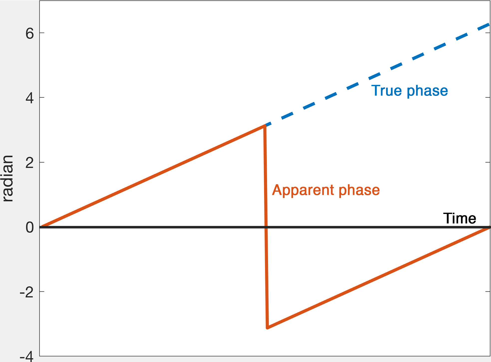

.. _fmritoolkit2019-exercise1-answer-e:

E. I don't know. I'm here to learn some fMRI analysis so just show me the answer
================================================================================

There is nothing wrong about the signal phase generated by the tissues. However, when we sampled the signal, the phase values are constrained to the range :math:`-\pi \leq phase < \pi`. When the true phase is outside of this range, a :math:`\pi` will be added or subtracted to the true phase such that the *apparent* phase we observed from the data will still be inside the range.

   Figure 1: An illustration of phase wrapping. The actual phase developed outside the range :math:`-\pi \leq phase < \pi` over time but our measurement will only show the apparent phase.

.. note:: Think of an analogue clock with one hand only representing the hour. Every 12 hours the hand starts a new cycle again. If you look at the clock 13 hours after the first watch, it apparently advanced 1 hour only but the actual time difference between the two observations is 13 hours.

Back to :ref:`fmritoolkit2019-exercise1`.
