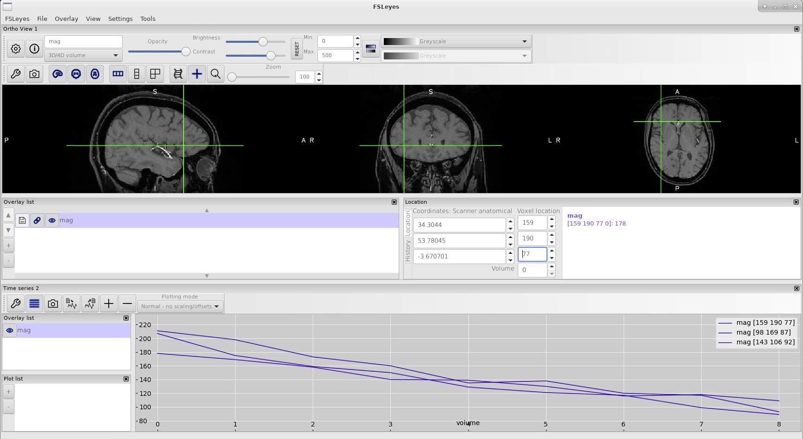

.. _fmritoolkit2019-exercise1-progress1:

Check You Progress 1
====================

You should observe the signals are decaying over time in general, which results from water protons losing phase coherence over time. It can be due to field inhomogeneity/diffusion/imperfect shimming etc. Magnitude images can be very useful to improve the quality of a QSM map because they share similar (but not the always same!) contrasts. 

Back to :ref:`fmritoolkit2019-exercise1`.