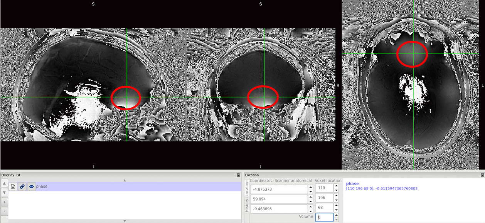

.. _fmritoolkit2019-exercise1-progress2:

Check Your Progress 2
=====================

It seems that in some regions the phase contrast is changing linearly with time (blue arrows, the white matter tract and gyrus are more pronounced in later echoes), but not in regions close to the prefrontal cortex and temporal lobes. In those regions, you should see more and more replications of the zebra-line pattern (which represents phase jumps) appeared in the later echoes. 

Back to :ref:`fmritoolkit2019-exercise1`.
