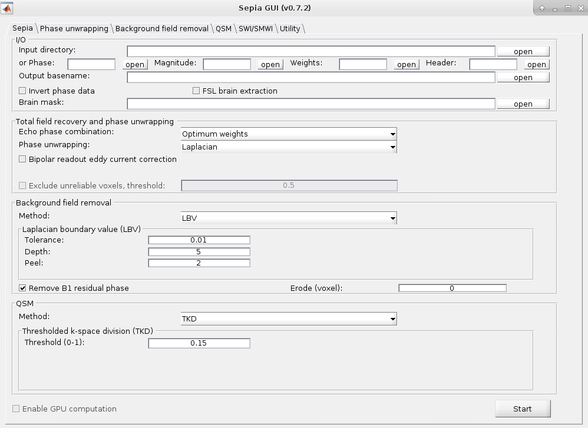
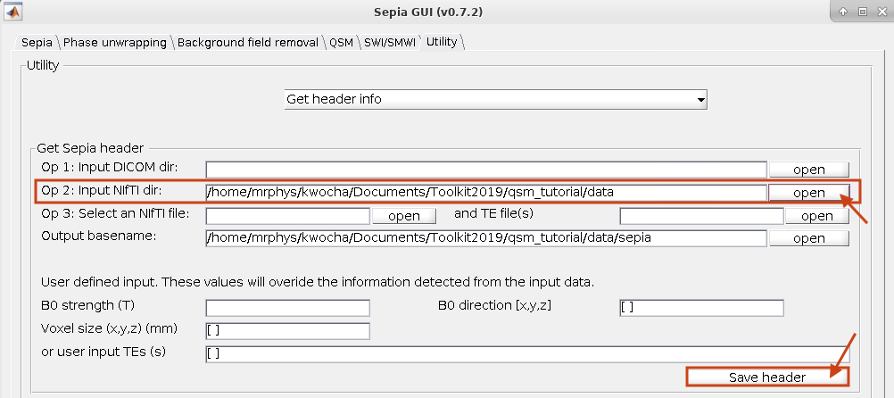
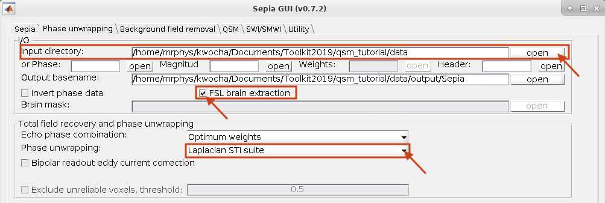

.. _fmritoolkit2019-exercise2:

Exercise 2
==========

Objectives
----------

- Gaining experience in using SEPIA
- Understanding how to perform phase unwrapping

Data Required
^^^^^^^^^^^^^

- a 4D raw phase data (*phase.nii.gz* in the input directory)
- a 4D raw magnitude data (*mag.nii.gz* in the input directory)
- JSON files generated by data conversion software (all .json in the input directory)

Estimated time
^^^^^^^^^^^^^^

About 15 min.

SEPIA
-----

SEPIA is a pipeline tool to process phase images in Matlab. To use SEPIA, please open a Matlab application in the cluster by typing:

``matlab2016b``,

click OK, leave the runtime as default and specify the memory requirement as 10 (GB).

.. image:: images/matlab_job.png
   :align: center

Once Matlab is open, go to the tutorial directory and add the SEPIA home directory to the Matlab Path:

``addpath('~/qsm_tutorial/sepia/');``

.. note:: The copy of SEPIA that you have in the tutorial directory already includes all the external toolboxes required. If you want to know how to setup SEPIA from scratch for your research purposes, you can refer to :ref:`gettingstart-installation`.

Now, go the data directory in the Matlab command window and start sepia:

``cd ~/qsm_tutorial/data`` 

``sepia``

A graphical user interface (GUI) should be pop up. 

The first tab in SEPIA provides a one-step application to process QSM from the raw phase data to a magnetic susceptibility map. 

Alternatively, we can break down the processing pipeline into several steps and SEPIA also supports this approach. 

Create SEPIA header
^^^^^^^^^^^^^^^^^^^

Before using the SEPIA, create a header file that contains all essential information regarding the data acquisition (magnetic field, resolution, echo time). 

Select the **Utility** tab and then select **Get header info** in the drop-down menu. This function provides several ways to extract the header information from different types of files. 

With all the NifTI images and JSON files stored in the same place, we can use 'Op 2' routine: 

#. click **Open** next to 'Op 2' 
#. select *~/qsm_tutorial/data* as the input (The dialog box will show the current directory in Matlab). 
#. click **Save header** to save the file. The process is done when you see the message '*SEPIA header is saved!*' in the command window. You should see a new file is generated in the input directory. 

Your setting should be similar to the following:

Phase Unwrapping and Total Field Computation
^^^^^^^^^^^^^^^^^^^^^^^^^^^^^^^^^^^^^^^^^^^^

To correct the wrapped phase in the raw images, go the **Phase unwrapping** tab (next to **Sepia** tab). 

You will see two panels under the tab: the **I/O** panel is for data input and output and the **Total field recovery and phase unwrapping** panel is for phase unwrapping and true phase accumulation estimation.

.. tip:: SEPIA supports two types of data input. If your data follows the SEPIA naming structure, you can select the directory containing all the input data as your input in the first row of **I/O** panel. Alternatively, you can specify the input files separately by following the instruction of the second row of the **I/O** panel. 

In the **I/O** panel:

#. Select the **Input directory**: *~/qsm_tutorial/data*
#. Change the **Output basename** to: *~/qsm_tutorial/data/output_unwrap/Sepia*
#. Check the **FSL brain extraction** 
   It is essential to have a brain mask to produce a high-quality QSM map.  

In the **Total field recovery and phase unwrapping** panel: 

#. Keep the **Echo phase combination** method as 'Optimum weights'
#. Change the **Phase unwrapping** method to 'Laplacian STI Suite'. 

It should look like this:

Then click the **Start** button.

You should now see some messages displayed in the Matlab's command window. These messages give you the general information of your input data and the overview of the selected method. Once the process finishes (~3min), you will see the message 

'*Processing pipeline is completed!*'. 

Check the output (should be in *~/qsm_tutorial/data/output_unwrap/*), in the terminal type: 

``fslview_deprecated Sepia_unwrapped-phase.nii.gz``

``fslview_deprecated Sepia_total-field.nii.gz``

The first dataset is the unwrapped phase images (unit in radian). Observe the phase development over time. All the zebra-line pattern and phase jumps are gone in the later echoes. 
The second corresponds to the frequency (Hz) which was computed using the unwrapped phase images at the different echo times:

.. math::
   frequency = \frac{phase}{time}
   :label: fpt

The latter is the result needed in the next exercise. 

Proceed to :ref:`fmritoolkit2019-exercise3`.
