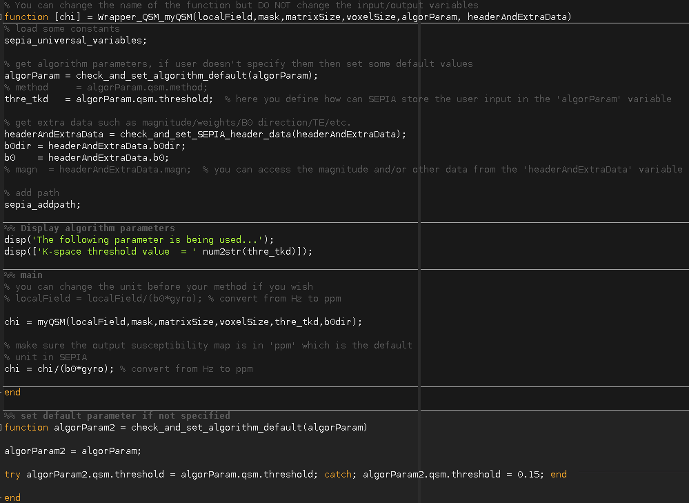
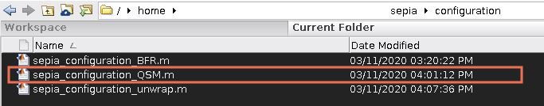
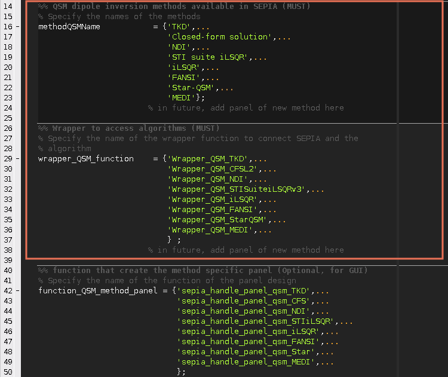
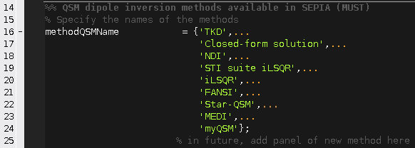
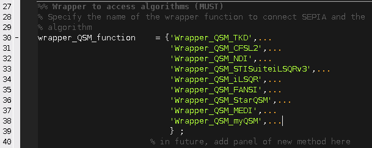

.. _integration_method_part1-index:

Integration of New BFR/QSM Method in SEPIA: Part 1
=======================================================================

Objectives
----------

- Learn how to add a new method to SEPIA framework
- Understanding structure of SEPIA processing back end

Target Audience
^^^^^^^^^^^^^^^

- who has some experience with SEPIA
- researchers who want to add their method(s) to SEPIA framework 

Estimated Time
^^^^^^^^^^^^^^

About 30 minutes

Introduction  
------------

In this tutorial, we will practice how a new method can be integrated to the SEPIA processing back end. If you are interested to have your method also shown in the SEPIA front end GUI, please visit the Part 2 of this tutorial.

Exercise
--------

To begin with, let's go to the ``/SEPIA_HOME/tutorial/myQSMmethod/``. You should see there are four Matlab scripts in the folder:

.. figure:: images/figure01_files.png
   :align: center
   
We will need ``myQSM.m`` and ``Wrapper_QSM_myQSM.m`` these two files in this tutorial. 

Let's have a look on the ``myQSM.m``

.. figure:: images/figure02_myQSM.png
   :align: center

myQSM.m
^^^^^^^

``myQSM.m`` is basically a thresholded k-space method to perform the QSM dipole inversion process. It requires 4 essential and 2 optional input variables:  

**Essential variables**
- *localField*: 3D matrix of a local (tissue) field map, unit is unimportant in this function
- *mask*: 3D matrix of a signal mask
- *matrixSize*: 1-by-3 array to indicate the matrix size of the local field map
- *voxelSize*: 1-by-3 array to indicate the spatial resolution of the local field map, in mm

**Optional variables**
- *thres*: a threshold of k-space cooridate to avoid division-by-zero problem
- *b0dir*: main magnetic field direction with respect to the local field map

The function returns one output variable which is the magnetic susceptibility map, *chi*, and has the same unit as the local field map input.

Wrapper_QSM_myQSM.m
^^^^^^^^^^^^^^^^^^^

``Wrapper_QSM_myQSM.m`` is a wrapper function to connect ``myQSM.m`` to the SEPIA framework. We will go through the function step by step to see more details:

**Anatomy of Wrapper_QSM_myQSM**

.. code-block:: matlab

	function [chi] = Wrapper_QSM_myQSM(localField,mask,matrixSize,voxelSize,algorParam,headerAndExtraData)

First of all, you can define the function's name with your own preference but the format of input and output variables in this wrapper function are fixed and you should not make any changes on them.

.. code-block:: matlab

   % load some constants 
   sepia_universal_variables;

Some constant terms such as the gyromagnetic ratio of 1H are used in various occasions and can be called using the ``sepia_universal_variables`` function.

.. code-block:: matlab

   % get algorithm parameters, if user doesn't specify them then set some default values
   algorParam = check_and_set_algorithm_default(algorParam);
   thre_tkd   = algorParam.qsm.threshold;  % here you can define how SEPIA will store the user input in the 'algorParam' variable

In this example, we need the threshold value defined by the user to threshold the k-space coordinate in ``myQSM.m``. All the user-defined parameters of the chosen method(s) are stored in *algorParam* input in SEPIA. The variable name (e.g. *algorParam.qsm.threshold* here) is defined by the developer and used in the pipelin configuration file. *check_and_set_algorithm_default* is a nested function to make sure the required variable is set (either by user or using the default value) before it is used.

.. code-block:: matlab

   % get extra data such as magnitude/weights/B0 direction/TE/etc.
   headerAndExtraData = check_and_set_SEPIA_header_data(headerAndExtraData);
   b0dir = headerAndExtraData.b0dir;
   b0    = headerAndExtraData.b0;
   % magn  = headerAndExtraData.magn;  % you can access the magnitude and/or other data from the 'headerAndExtraData' variable

To create a dipole kernel wih correct orientation, the algorithm needs to know the main magnetic field direction which can be obtained from the *headerAndExtraData* variable. If the multi-echo magnitude data and/or SNR-weighted map are needed, they can also be accessed in this variable as well.

.. code-block:: matlab

   % add path
   sepia_addpath;

You can add the required path(s) in the function. 

.. code-block:: matlab

   %% Display algorithm parameters
   disp('The following parameter is being used...');
   disp(['K-space threshold value  = ' num2str(thre_tkd)]);

You can also provide some feedback to user by displaying the algorithm parameters/other information in the function.

.. code-block:: matlab

   %% main
   % you can change the unit before your method if you wish
   % localField = localField/(b0*gyro); % convert from Hz to ppm

   chi = myQSM(localField,mask,matrixSize,voxelSize,thre_tkd,b0dir);
         
   % make sure the output susceptibility map is in 'ppm' which is the default
   % unit in SEPIA
   chi = chi/(b0*gyro); % convert from Hz to ppm

Once all input are ready, you can call your method to compute the susceptibility map (or local field map, depended on the objective of the method). Feel free to adapt the data for the needs of the method. The only requirement is to return the susceptibility map, *chi*, with unit of ppm.

With these two files, the method is almost ready for SEPIA. Before we can use this method in SEPIA, we need to update the method configuration file of SEPIA. To do that, go to the SEPIA configuration directory: ``/SEPIA_HOME/configuration/``

You can see there are three configuration files in the directory, each of them specifies the methods available in SEPIA. Now open the ``sepia_configuration_QSM.m`` in the editor. You will see the script is divided into 4 sections. We only focus the first two in this tutorial. 

In the first section, the variable *methodQSMName* contains the names of QSM methods available in SEPIA and we need to add myQSM to this variable. This name will be used thorough the SEPIA framework. **DO NOT** change the order of the method! Insert our method to the end of the variable instead, as follow:

In the second section, the variable *wrapper_QSM_function* contains the filenames of the wrapper functions and we also need to add ours to the end of this vaiable as follow:

.. warning::
   The order of the newly added method has to be the same in these two variables (*methodQSMName* & *wrapper_QSM_function*), i.e. if ``methodQSMName{9}='myQSM'`` then ``wrapper_QSM_function{9}='Wrapper_QSM_myQSM'``.

Now, the method is available in SEPIA! You can use the method in command based operation such as ``SEPIAIOWrapper.m`` and ``QSMIOWrapper.m``, e.g. :

.. code-block:: matlab

   algorParam.qsm.method      = 'myQSM';
   algorParam.qsm.threshold   = 0.1; 
