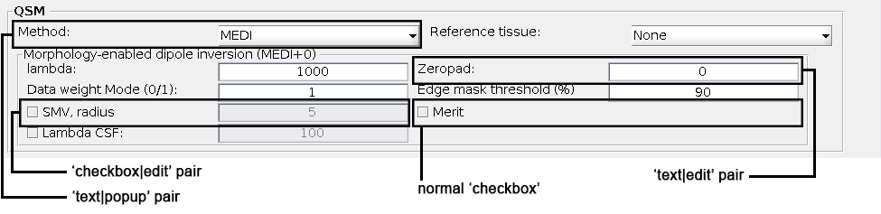
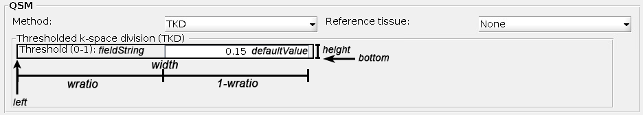

.. _integration_method_part2-index:

Integration of New BFR/QSM Method in SEPIA: Part 2
=======================================================================

Objectives
----------

- Learn how to add a new method to SEPIA GUI

Target Audience
^^^^^^^^^^^^^^^

- who has completed Part 1 of the tutorial
- researchers who want to add their method(s) to SEPIA framework 

Estimated Time
^^^^^^^^^^^^^^

About 1 hour

Introduction  
------------

In this tutorial, we will practice how to add a new method to the SEPIA GUI. you should complete the tutorial Part 1 before proceeding to this tutorial.

GUI is a major component of SEPIA. It provides the most straightfoward way to access all avaiable resources of QSM processing in SEPIA framework. The main goal of the GUI is to generate a pipeline configuration file containing all the processing tasks, methods and algorithm parameters specified by the users and used to trigger the QSM processing. The configuration file can also be executed without initializing the GUI since it directly accesses the processing back end. 

The full QSM processing pipeline in SEPIA can be summarised into 4 task panels, including:

1. Data input/output panel 
2. Total field recovery and phase unwrapping panel
3. Background field removal panel
4. QSM panel

For each processing task, there are multiple methods available to perform the task. Generally, each method has it own method panel in the GUI to obtain information from the users.

.. figure:: images/figure01_method_panel.png
   :align: center
  
The method panel will be switched from one to another based on the current selected method in the task panel. 

There are two main objectives we need to accomplish in this tutorial:

1. design a method panel that can obtain information from the user, and
2. export and import the information to/from a pipelin configuration file.

Exercise
--------

To begin with, let's go to the ``/SEPIA_HOME/tutorial/myQSMmethod/``. You should see there are four Matlab scripts in the folder:

.. figure:: images/figure02_files.png
   :align: center
   
In Part 1, we demonstrated how to connect ``myQSM.m`` to the SEPIA processing back end using ``Wrapper_QSM_myQSM.m`` as a connector. In this tutorial, we will use the remaining two files: ``sepia_handle_panel_qsm_myQSM.m`` and ``get_set_qsm_myQSM.m``

``sepia_handle_panel_qsm_myQSM.m``
^^^^^^^^^^^^^^^^^^^^^^^^^^^^^^^^^^

Each method in SEPIA GUI has it own panel to obtain information from users. This information can be a value (e.g. tolerance), a decision (e.g. true/false), a selection (given choices) and many others. We will go through the script to understand how a panel can be designed in SEPIA GUI.

.. figure:: images/figure03_panel_script.png
   :align: center
   
**Anatomy of sepia_handle_panel_qsm_myQSM.m**

.. code-block:: matlab

	function h = sepia_handle_panel_qsm_myQSM(hParent,h,position)

For every new panel you can decide a new name of the function. However, the input and output variables are fixed and should not be changed.

.. code-block:: matlab

   %% set default values
   defaultThreshold = 0.15;

We first decide the default input value that will be showed in the GUI.

.. code-block:: matlab

   %% Tooltips
   tooltip.qsm.myQSM.threshold	= 'K-space threshold';

You can also add tooltips to further explain the information the method required.

.. code-block:: matlab

   %% layout of the panel
   nrow        = 4;
   rspacing    = 0.01;
   ncol        = 2;
   cspacing    = 0.01;
   [height,bottom,width,left] = sepia_layout_measurement(nrow,rspacing,ncol,cspacing);

In principle develops can design the layout of the method panel with their own style. In SEPIA, the ``sepia_layout_measurement`` function can help standardise the panel layout by creating a evenly distributed grid. It requires the following input:

- *nrow*: number of rows in the grid
- *rspacing*: spacing between consecutive rows, in normalised unit
- *ncol*: number of columns in the grid
- *cspacing*: spacing between consecutive columns, in normalised unit

It returns four variables that specify the position of each cell in the grid:

- *height*: height of the cell, in normalised unit
- *bottom*: 1-by-*nrow* array indicating the bottom position of the cell, starting from the top of the panel
- *width*: width of the cell, in normalised unit
- *left*: 1-by-*ncol* array indicating the left position of the cell, starting from the left

.. figure:: images/figure04_grid.png
   :align: center

.. code-block:: matlab

   h.qsm.panel.myQSM = uipanel(hParent,...
      'Title','My QSM dipole inversion',...
      'position',position,...
      'backgroundcolor',get(h.fig,'color'),'Visible','on');

Firstly, we create a panel in SEPIA. This panel belongs to the QSM task panel which is specified in the *hParent* input. The only thing you can change is the '*Title*' value here. 

.. code-block:: matlab

   panelParent = h.qsm.panel.myQSM;

    % width of the first element in a cell, in normalised unit
    wratio = 0.5;
    
    % row 1, col 1
    % text|edit field pair: threshold
    [h.qsm.myQSM.text.threshold,h.qsm.myQSM.edit.threshold] = sepia_construct_text_edit(...
        panelParent,'Threshold (0-1):', defaultThreshold, [left(1) bottom(1) width height], );

Secondly, we can start adding operational functions to the method panel. There are many operations you can add to the method panel in order to obtain input from users. SEPIA provides three functions to simplify the work of adding operations to the panel, including:

1. ``sepia_construct_text_edit``: create a 'text|edit' pair to obatin (numerical) input from users;
2. ``sepia_construct_text_popup``: create a 'text|popup' pair to obatin predefined input from users by selection;
3. ``sepia_construct_checkbox_edit``: create a 'checkbo|edit' pair to obatin a logical decision (true or false) from users plus an optional numerical input.

These three functions cover most of the operations in SEPIA. For detail description of how the functions work please check the header of the functions. In this tutorial, we only use the ``sepia_construct_text_edit`` function to obatin the k-space threshold value from the user.

.. code-block:: matlab

   function [h_text,h_edit] = sepia_construct_text_edit(parent,fieldString,defaultValue,pos,wratio)

``sepia_construct_text_edit`` requires 5 input variable:

- *parent*: parent handle of the operation, which is the handle of the panel (e.g. h.qsm.panel.myQSM)
- *fieldString*: the text displayed in the 'text' field of the operation (e.g. 'Threshold (0-1):')
- *defaultValue*: the value displayed in the 'edit' field of the operation (e.g. defaultThreshold)
- *pos*: the position of the entire operation ('text'+'edit' fields), [left bottom width height] (e.g. [left(1) bottom(1) width height])
- *wratio*: the normalised width taken by the 'text' field.

The function returns two output variables:

- *h_text*: handle of the 'text' field, (e.g. *h.qsm.myQSM.text.threshold* in this tutorial)
- *h_edit*: handle of the 'edit' field, (e.g. *h.qsm.myQSM.edit.threshold*)

These three SEPIA functions are resbonsible for only creating the GUI components. The function of these operations are still missing. 

.. code-block:: matlab

   %% set tooltips
   set(h.qsm.myQSM.text.threshold, 'Tooltip',tooltip.qsm.myQSM.threshold);

Here we set the tooltips that was defined in the beginning of the file to the 'text' field of the panel.

.. code-block:: matlab

   %% set callbacks
   set(h.qsm.myQSM.edit.threshold, 'Callback', {@EditInputMinMax_Callback,defaultThreshold,0,0,1});

The callback function allows developer to control the behaviour of the user input. Here we utilise a function called ``EditInputMinMax_Callback`` in SEPIA to limit the range of the input value from the users. Let's have a look to this function

.. code-block:: matlab

   EditInputMinMax_Callback(source,eventdata,defaultValue,isIntegerInput,lb,ub)

Ingoring the input variables *source* and *eventdata*, this function takes three extra input from the developer:

- *defaultValue*: whenever an invalid value is entered, returns to this value (e.g. returns to *defaultThreshold* in this tutorial)
- *isIntegerInput*: whether the input is an integer or not ('true': input needed to be integer; 'false': input can be floating number) (e.g. the input can be floating number in this tutorial)
- *lb*: lower bound of the input value (e.g. the minimum number is 0 in this example)
- *ub*: upper bound of the input value (e.g. the maximum number is 1 in this example)

Now, the method panel is ready for the GUI. Our next job is to make sure the user input can be correctly exported to the pipeline configuration file and afterward imported from the pipeline configuration file to the GUI which will be done the next section.

``get_set_qsm_myQSM.m``
^^^^^^^^^^^^^^^^^^^^^^^

