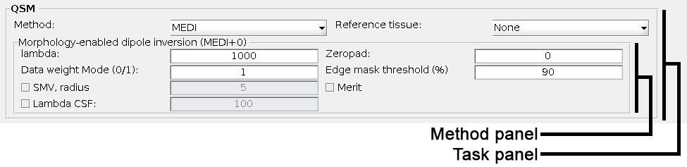
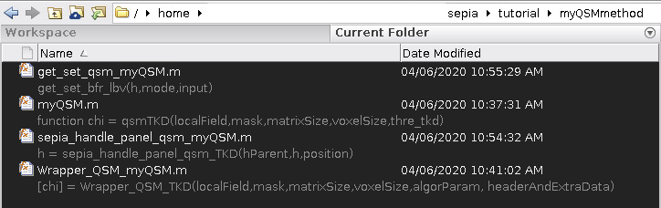

.. _integration_method_part2-index:

Integration of New BFR/QSM Method in SEPIA: Part 2
=======================================================================

Objectives
----------

- Learn how to add a new method to SEPIA GUI

Target Audience
^^^^^^^^^^^^^^^

- who has completed Part 1 of the tutorial
- researchers who want to add their method(s) to SEPIA framework 

Estimated Time
^^^^^^^^^^^^^^

About 1 hour

Introduction  
------------

In this tutorial, we will practice how to add a new method to the SEPIA GUI. you should complete the tutorial Part 1 before proceeding to this tutorial.

GUI is a major component of SEPIA. It provides the most straightfoward way to access all avaiable resources of QSM processing in SEPIA framework. The main goal of the GUI is to generate a pipeline configuration file containing all the tasks, methods and algorithm parameters specified by the users and used to trigger the QSM processing. The configuration file can also be executed without initializing the GUI since it directly accesses the processing back end. 

The full QSM processing pipeline in SEPIA can be summarised into 4 task panels, including:

1. Data input/output panel 
2. Total field recovery and phase unwrapping panel
3. Background field removal panel
4. QSM panel

For each processing task, there are multiple methods available to perform the task. Generally, each method has it own method panel in the GUI to obtain information from the users.

  
The method panel will be switched from one to another based on the current selected method in the task panel. 

There are two main objectives we need to accomplish in this tutorial:

1. design a method panel that can obtain information from the user, and
2. export and import the information to/from a pipelin configuration file.

Exercise
--------

To begin with, let's go to the ``/SEPIA_HOME/tutorial/myQSMmethod/``. You should see there are four Matlab scripts in the folder:

   
In Part 1, we demonstrated how to connect ``myQSM.m`` to the SEPIA processing back end using ``Wrapper_QSM_myQSM.m``. In this tutorial, we will use the remaining two files: ``sepia_handle_panel_qsm_myQSM.m`` and ``get_set_qsm_myQSM.m``

``sepia_handle_panel_qsm_myQSM.m``
^^^^^^^^^^^^^^^^^^^^^^^^^^^^^^^^^^

Each method in SEPIA GUI has it own algorithm panel. This panel is useful to obtain information from users. This information can be a value (e.g. tolerance) or others.

